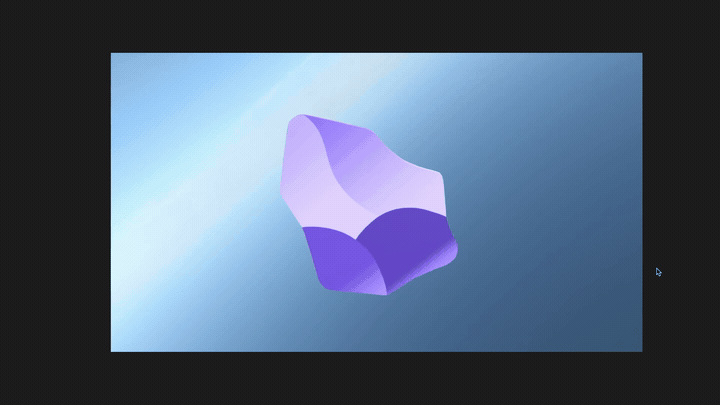

  
  
  <h1 align="center">IMAGE RENDER</h1>
  <h3 align="center"> A Rᴇsɪʟɪᴇɴᴛ ᴀɴᴅ Cᴀᴄʜᴇ-Bᴀᴄᴋᴇᴅ Fᴜᴢᴢʏ Mᴇᴅɪᴀ Wᴀᴛᴄʜᴇʀ </h3>

  <!-- TOP PURPLE LINKS -->
  
  
  
   
  <!-- BOTTOM GOLD TAXONOMY -->
  
  
  
  

  
<i>A smart, reusable, and resilient media rendering component designed to display images or Lottie animations without requiring exact hardcoded file paths.</i>

---

## 📌 Introduction & Overview

**Image Render** is a premium, zero-dependency visualizer leaf for Obsidian and Datacore that bridges the gap between static asset references and a highly volatile vault structure. When a note requests media (whether a standard `.png`/`.webp` image or a highly interactive Lottie `.json` vector loop), it only provides a basic file name. 

The Image Render component takes over by dynamically initializing a local fuzzy search index, finding the matching target within milliseconds, fetching script dependencies on-demand, caching them locally in a secure vault location, and rendering the media with clean HSL boundaries.

---

## ✨ Features

### 🛡️ Runtime & Agentic Safety
*   **Fuzzy Target Resolution**: Implements `Fuse.js` fuzzy indexing across vault boundaries with a precision threshold of `0.4`. Relocating, renaming, or slightly misspelling a filename will never break the rendering pipeline.
*   **Dual Media Auto-Detection**: Dynamically maps incoming streams based on file signatures, isolating PNGs/WebPs for standard rendering and instantiating interactive `<lottie-player>` custom elements for vector animations.
*   **Asynchronous Content Buffering**: Defers layout commits using zero-millisecond timeouts, preventing frame thrashes or layout-shifting while resolving path indexes.

### 🔐 Security & Integrations
*   **Sandboxed CDN Caching**: Dynamically requests script dependecies (`Fuse.js` and `lottie-player`) from secure, public CDNs on the first run.
*   **Local Caching Shield**: Saves downloaded third-party libraries locally under `.datacore/script_cache/` in the vault via `app.vault.adapter`. All subsequent mounts load instantly and securely without external internet connection.
*   **Strict Scope Isolations**: Features full class-style encapsulation using styled JSX sheets. The container rules never bleed into the global Obsidian DOM.

### 📐 User Interface & Developer Loop
*   **Emoji-Free Layouts**: Complies fully with corporate aesthetic standards by replacing standard emojis with animated Lucide vectors (e.g., `<dc.Icon icon="loader-2" />`).
*   **Aspect Ratio Lock**: Ensures responsive, container-filling designs using `object-fit: contain` boundaries, guaranteeing clean scaling from miniature note sidebars to full-screen canvasses.
*   **Decoupled Architecture**: Strictly separates the active bootstrapper (`index.jsx`), the view orchestrator (`App.jsx`), and the script-caching worker (`loadScript.js`) into separate, clean files.

---

## 📦 Directory Index & Components

The package exposes the following compiled files:

| File | Description |
| :--- | :--- |
| **[IMAGE RENDER.md](IMAGE%20RENDER.md)** | The main entry point designed to be loaded inside Obsidian workspace leaves or canvases. |
| **[_RESOURCES/DATACORE/_DONE/IMAGE RENDER/src/index.jsx](_RESOURCES/DATACORE/_DONE/IMAGE%20RENDER/src/index.jsx)** | Main bootstrapper/loader hook that resolves outer directories and coordinates imports. |
| **[_RESOURCES/DATACORE/_DONE/IMAGE RENDER/src/App.jsx](_RESOURCES/DATACORE/_DONE/IMAGE%20RENDER/src/App.jsx)** | The core coordinator view component that handles fuzzy searching, Lottie configurations, and loading indicators. |
| **[src/utils/loadScript.js](src/utils/loadScript.js)** | Dynamic utility that handles script downloads and writes them to the local vault adapter cache. |
| **[METADATA.md](_RESOURCES/DATACORE/_DONE/IMAGE%20RENDER/METADATA.md)** | Machine-readable indexing manifest outlining component capabilities, type, and offline permissions. |
| **[CONTRIBUTION.md](_RESOURCES/DATACORE/_DONE/IMAGE%20RENDER/CONTRIBUTION.md)** | Contributor architecture specifications and development guidelines. |
| **[LICENSE.md](_RESOURCES/DATACORE/_DONE/IMAGE%20RENDER/LICENSE.md)** | MIT open-source license. |
